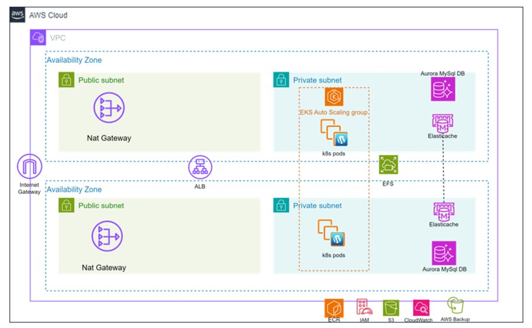
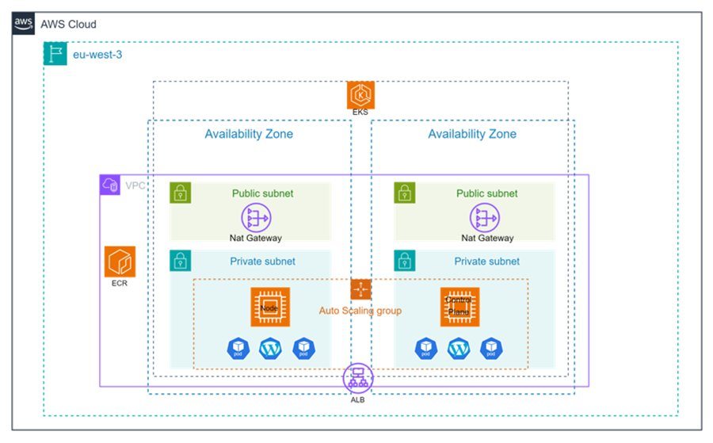
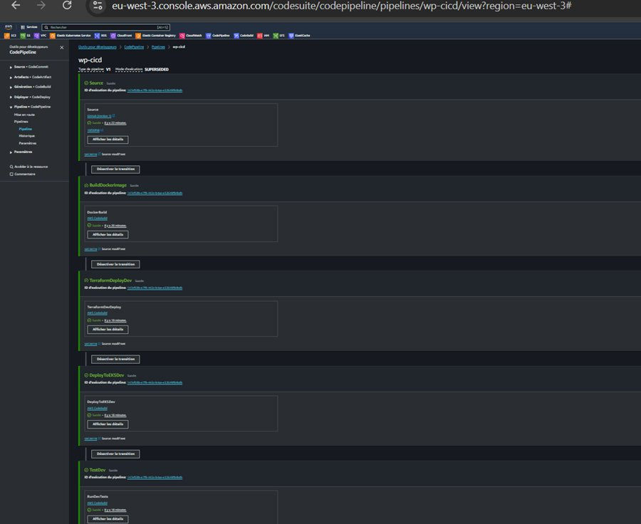

# 🚀 WordPress on AWS EKS — Production-Grade Deployment

> **Automated, secure and scalable WordPress deployment on AWS using Terraform, Kubernetes (EKS), Aurora MySQL, and a full CI/CD pipeline.**

---

## 📋 Table of Contents

- [Overview](#overview)
- [Architecture](#architecture)
- [Tech Stack](#tech-stack)
- [Infrastructure Details](#infrastructure-details)
- [CI/CD Pipeline](#cicd-pipeline)
- [Monitoring](#monitoring)
- [Project Structure](#project-structure)
- [Key Learnings](#key-learnings)
- [Author](#author)

---

## Overview

This project deploys a WordPress application on AWS with a production-grade infrastructure built entirely with Infrastructure as Code (Terraform). It demonstrates end-to-end DevOps practices: automated provisioning, container orchestration, continuous deployment, and real-time monitoring.

**Key objectives:**
- Fully automated infrastructure with Terraform (IaC)
- Containerized WordPress deployed on AWS EKS (Kubernetes 1.29)
- Secure architecture following least-privilege IAM principles
- Complete CI/CD pipeline with dev → test → production promotion
- Real-time monitoring with Prometheus + Grafana

**Constraints:** Budget capped at $100/month on AWS, deployed in `eu-west-3` (Paris).

---

## Architecture

### Infrastructure globale — VPC Multi-AZ



Le VPC (`10.0.0.0/16`) est déployé sur deux Availability Zones (`eu-west-3a` et `eu-west-3b`) avec des subnets publics pour les NAT Gateways et l'ALB, des subnets privés pour les pods Kubernetes, et des subnets data isolés pour Aurora MySQL et ElastiCache. Les services transverses (ECR, IAM, S3, CloudWatch, AWS Backup) complètent l'infrastructure.

### Cluster EKS Production



Le cluster `webservice-cluster` (Kubernetes 1.29) s'étend sur deux zones de disponibilité. Chaque AZ héberge un subnet public avec NAT Gateway et un subnet privé avec des worker nodes EC2 dans un Auto Scaling Group. L'Application Load Balancer (ALB) répartit le trafic entre les pods WordPress.

---

## Tech Stack

| Category | Technology |
|---|---|
| **Cloud Provider** | AWS (eu-west-3 — Paris) |
| **IaC** | Terraform (modular, reusable) |
| **Container Orchestration** | AWS EKS — Kubernetes 1.29 |
| **Container Registry** | AWS ECR |
| **Database** | Aurora MySQL (Multi-AZ, 2 instances) |
| **Cache** | ElastiCache Memcached |
| **Storage** | EBS (persistent volumes) + EFS |
| **CI/CD** | AWS CodePipeline + CodeBuild |
| **Monitoring** | Prometheus + Grafana (via Helm) |
| **Logging** | AWS CloudWatch |
| **Security** | IAM (least privilege), Security Groups, SSL/TLS (ACM) |
| **Package Manager (K8s)** | Helm |

---

## Infrastructure Details

### Network (VPC)

| Subnet | CIDR | Zone | Purpose |
|---|---|---|---|
| Public 1 | `10.0.1.0/24` | eu-west-3a | NAT Gateway, ALB |
| Public 2 | `10.0.2.0/24` | eu-west-3b | NAT Gateway, ALB |
| Private App 1 | `10.0.11.0/24` | eu-west-3a | EKS Worker Nodes |
| Private App 2 | `10.0.12.0/24` | eu-west-3b | EKS Worker Nodes |
| Private Data 1 | `10.0.21.0/24` | eu-west-3a | Aurora, ElastiCache |
| Private Data 2 | `10.0.22.0/24` | eu-west-3b | Aurora, ElastiCache |

### Kubernetes Cluster

- **Name:** `webservice-cluster`
- **Version:** Kubernetes 1.29
- **Node type:** `t3.medium` (Spot instances)
- **Autoscaling:** Cluster Autoscaler enabled
- **Namespaces:** `default` (dev), `production` (prod)

### Database — Aurora MySQL

- **Cluster:** `webservice-aurora-cluster`
- **Database:** `wordpress_db`
- **Instances:** 2 × `db.t3.medium` (Multi-AZ)
- **Backups:** Automatic daily snapshots

### Cache — ElastiCache

- **Type:** Memcached `cache.t3.micro`
- **Nodes:** 1 (dev/test environment)

---

## CI/CD Pipeline



Le pipeline est entièrement automatisé avec **AWS CodePipeline + CodeBuild**, déclenché à chaque push sur GitHub.

### Pipeline Stages

| Stage | Tool | Description |
|---|---|---|
| **Source** | GitHub | Triggered on push to `main` |
| **BuildDockerImage** | CodeBuild | Builds & pushes Docker image to ECR |
| **TerraformDeployDev** | CodeBuild + Terraform | Provisions dev infrastructure |
| **DeployToEKSDev** | CodeBuild + Helm | Deploys WordPress to dev cluster |
| **TestDev** | CodeBuild | Validates ALB endpoint & HTTP response |
| **Approval** | Manual gate | Human approval before production |
| **DeployToEKSProd** | CodeBuild + Helm | Promotes to production namespace |
| **MonitoringDeploy** | CodeBuild + Helm | Deploys Prometheus & Grafana |
| **DestroyInfrastructure** | Terraform | Optional teardown stage |

---

## Monitoring

Real-time observability is provided by **Prometheus** and **Grafana**, deployed inside the EKS cluster via Helm charts.

**Metrics collected:**
- Cluster CPU, Memory, Disk usage
- Pod health and replica status
- Network in/out per node
- Application-level HTTP response codes

**Dashboards:** Custom EKS Dashboard in Grafana providing live cluster health, deployment status, and resource utilization.

---

## Project Structure

```
aws_wp/
├── tf/                          # Terraform IaC
│   ├── modules/
│   │   ├── vpc/                 # VPC, Subnets, NAT Gateways
│   │   ├── eks/                 # EKS Cluster + Node Groups
│   │   ├── aurora/              # Aurora MySQL cluster
│   │   ├── cache/               # ElastiCache
│   │   ├── ecr/                 # Elastic Container Registry
│   │   ├── cloudwatch/          # Logging
│   │   ├── autoscaler/          # Cluster Autoscaler (IRSA)
│   │   └── subnets/             # Subnet configurations
│   ├── environments/
│   │   ├── test/                # Dev/test environment
│   │   └── prod/                # Production environment
│   └── docker/
│       └── dockerfile           # Custom WordPress Docker image
├── kube/
│   └── wordpress-chart/         # Helm chart for WordPress
│       └── templates/           # Kubernetes manifests
├── CodePipeline/                # CI/CD pipeline definitions
│   └── buildspec-*.yml          # CodeBuild build specs
└── README.md
```

---

## Key Learnings

**What worked well:**
- Modular Terraform structure made multi-environment deployments straightforward
- CodePipeline with manual approval gate provided a safe promotion workflow
- Helm charts simplified Kubernetes application management
- Prometheus + Grafana gave immediate visibility into cluster health

**Challenges overcome:**
- **IAM complexity:** Fine-grained IAM permissions required careful balancing between security (least privilege) and functionality. Over-restricting the admin IAM user caused visibility issues within the EKS cluster — solved by reviewing AWS EKS IAM documentation and using OIDC-based service accounts.
- **Cost management:** Staying within the $100/month budget required using Spot instances for worker nodes and `t3.micro`/`t3.medium` instance types throughout.

---

## Author

**Fanta Koné** — Cloud & Security Engineer | DevOps | AI

- 🌐 [fantakone.com](https://fantakone.com)


---

*Project completed as part of the DevOps Engineer training at DataScientest — November 2024*
